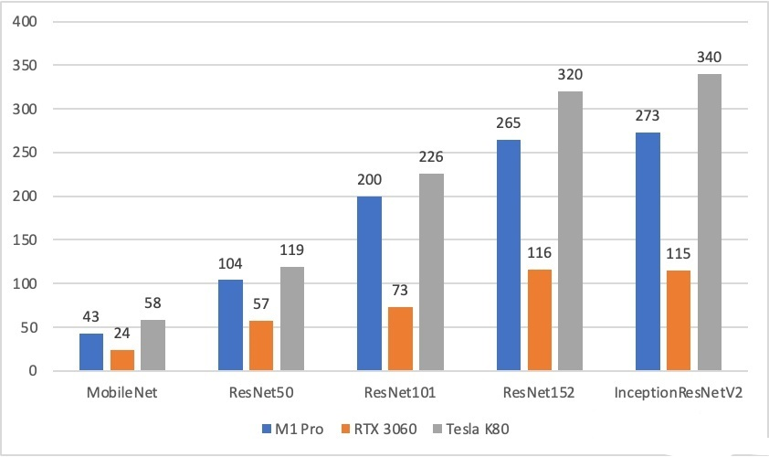
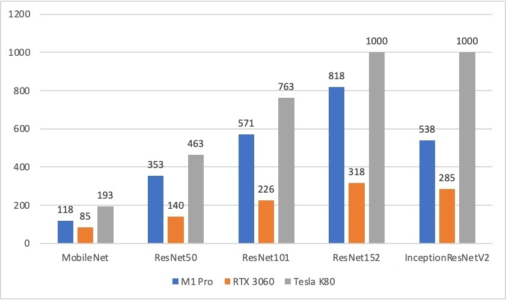

## TensorFlow-metal test
This repository is a brief test of [TensorFlow-metal](https://developer.apple.com/metal/tensorflow-plugin/) on Apple M1 Pro chip.  
The test includes inference and training time of models below:
- MobileNet
- ResNet50
- ResNet101
- ResNet152
- InceptionResNetV2

## Code
See Python Script `tf_test.py` ot notebook `tf_test.ipynb`.
Google Colab link is also available [here](https://colab.research.google.com/drive/1LonSrTAdrbOZseOaz3WFLhOtsgunaulT?usp=sharing)

## Results
The script was executed on three devices
- Apple M1 Pro (MacBook Pro)
- RTX 3060 (GPU Server)
- Tesla K80 (Google Colab)

Here are the results  
- Inference time  
  
- Training time  

Apple M1 Pro chip performs a bit better than K80.
